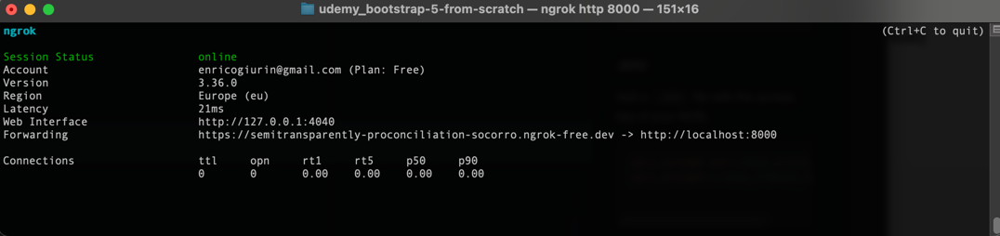
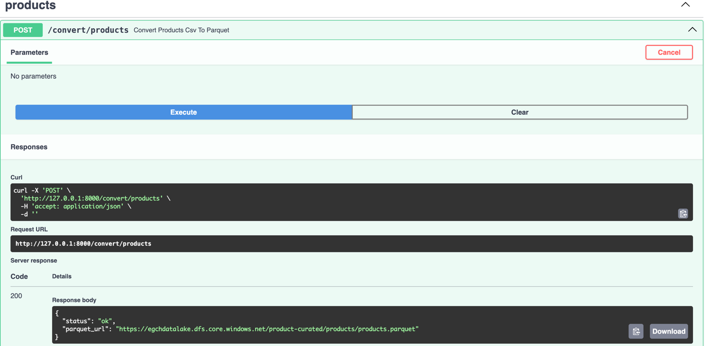
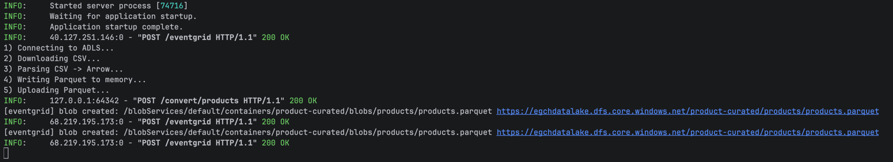

# python DataLake
Access to Azure DataLake via python 
## Description
This project demonstrates integration between a Python FastAPI application and an Azure Data Lake Storage account.
It uses Azure Event Grid to deliver event-driven notifications when new assets are uploaded to storage.
Events are pushed to a secure webhook endpoint exposed by FastAPI over HTTPS.
The setup showcases a lightweight, serverless-friendly, event-driven architecture without polling.
## Setup
Create the env
```shell
python3 -m venv .venv
```

Activate the env - Windows
```shell
.venv\Scripts\Activate.ps1
```

Activate the env - Mac
```shell
source .venv/bin/activate
```


Install the libraries
```shell
pip install fastapi uvicorn
pip install python-dotenv
pip install azure-storage-file-datalake
pip install pandas pyarrow
pip install azure-storage-queue
```

Freeze the requirements
```shell
 pip freeze > requirements.txt
```

### Check
```shell
 uvicorn main:app --reload 
```

### .env
Add a `.env` file with the access key of your ADSL
```properties
ADLS_ACCOUNT_KEY=<YOUR_ACCESS_KEY>
ADLS_ACCOUNT=<>YOUR_STORAGE_ACCOUNT>

```
### URL
[health](http://127.0.0.1:8000/health)

[docs](http://127.0.0.1:8000/docs)

## Azure WebHook
### ngrok for SSL
Create an account on [ngrok](https://ngrok.com/signup)
```shell
brew install ngrok/ngrok/ngrok
ngrok config add-authtoken <YOUR_TOKEN>
```

Start fastapi with:
```shell
uvicorn main:app --host 127.0.0.1 --port 8000 --reload
```
Map your port to ngrok url with ssl
```shell
ngrok http 8000
```


### Configure webhook endpoint
- Create an event subscription
- Endpoint: WebHock
- Copy the url created by ngrok, i.e.: https://semitransparently-proconciliation-socorro.ngrok-free.dev + /eventgrid

## Sanity test
Publish a new BLOG into storage account.

swagger: http://127.0.0.1:8000/docs#



You should see the webhook endpoint called on your fastapi.

