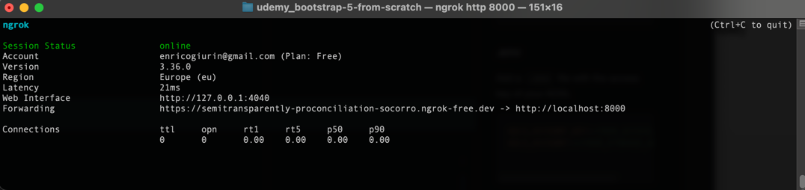
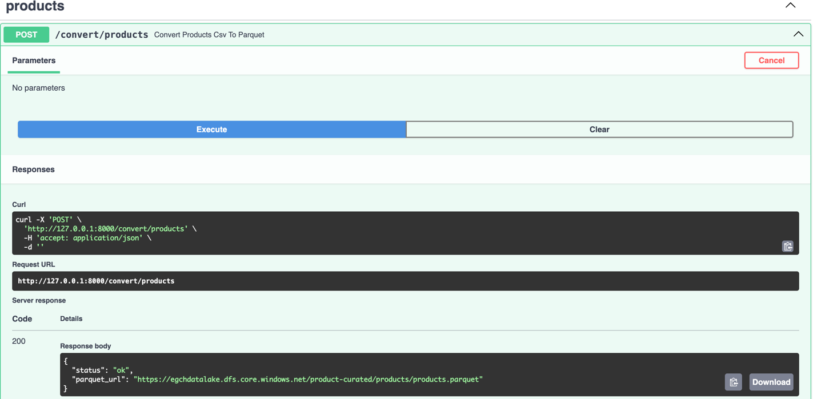
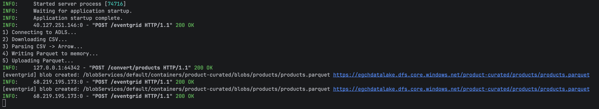

# Azure FastAPI DataLake
Access to Azure DataLake via python 
## Description
This project demonstrates integration between a Python FastAPI application and an Azure Data Lake Storage account.
It uses Azure Event Grid to deliver event-driven notifications when new assets are uploaded to storage.
Events are pushed to a secure webhook endpoint exposed by FastAPI over HTTPS.
The setup showcases a lightweight, serverless-friendly, event-driven architecture without polling.
## Dependencies

| Package | Purpose |
|---|---|
| `fastapi` | Web framework for the API |
| `uvicorn` | ASGI server to run FastAPI |
| `python-dotenv` | Load environment variables from `.env` |
| `azure-storage-file-datalake` | Azure Data Lake Storage Gen2 client |
| `azure-storage-queue` | Azure Storage Queue client |
| `azure-servicebus` | Azure Service Bus client (producer & consumer) |
| `azure-eventhub` | Azure Event Hub client (producer & consumer) |
| `azure-eventhub-checkpointstoreblob` | Blob-backed checkpoint store for Event Hub consumer |
| `azure-identity` | Azure authentication (`DefaultAzureCredential`) |
| `azure-storage-blob` | Azure Blob Storage client (file uploads) |
| `python-multipart` | Multipart form data support for file uploads in FastAPI |
| `pandas` | Data manipulation |
| `pyarrow` | Parquet file reading/writing |

## Setup

Create the env
```shell
python3 -m venv .venv
```

Activate the env - Windows
```shell
.venv\Scripts\Activate.ps1
```

Activate the env - Mac
```shell
source .venv/bin/activate
```

Install the dependencies
```shell
pip install -r requirements.txt
```

### Check
```shell
 uvicorn main:app --reload 
```

### .env

```shell
cp .env_template .env
```
Update the values in the `.env `file accordingly.

⚠️ Never commit the `.env` file (it may contain sensitive data).


### URL
[health](http://127.0.0.1:8000/health)

[docs](http://127.0.0.1:8000/docs)

## Azure WebHook
### ngrok for SSL
Create an account on [ngrok](https://ngrok.com/signup)
```shell
brew install ngrok/ngrok/ngrok
ngrok config add-authtoken <YOUR_TOKEN>
```

Start fastapi with:
```shell
uvicorn main:app --host 127.0.0.1 --port 8000 --reload
```
Map your port to ngrok url with ssl
```shell
ngrok http 8000
```


### Configure webhook endpoint
- Create an event subscription
- Endpoint: WebHock
- Copy the url created by ngrok, i.e.: https://semitransparently-proconciliation-socorro.ngrok-free.dev + /eventgrid

## Azure Function Consumer

### Publish the Docker image

**1. Build the image:**
```shell
cd func_consumer
docker build -t egch/func-consumer:latest .
```

**2. Push to Docker Hub:**
```shell
docker login
docker push egch/func-consumer:latest
```

### Deploy to Azure

Fill in your `.env` file with the deployment variables (see `.env_template`), then source it:

```shell
source .env
```

**1. Login to Azure:**
```shell
az login
```

**2. Create an App Service Plan (Premium required for containers):**
```shell
az appservice plan create \
  --name $AZURE_PLAN_NAME \
  --resource-group $AZURE_RESOURCE_GROUP \
  --location "$AZURE_REGION" \
  --sku EP1 \
  --is-linux
```

**3. Create the Function App from the Docker Hub image:**
```shell
az functionapp create \
  --name $AZURE_FUNC_APP_NAME \
  --resource-group $AZURE_RESOURCE_GROUP \
  --plan $AZURE_PLAN_NAME \
  --storage-account $AZURE_STORAGE_ACCOUNT \
  --deployment-container-image-name egch/func-consumer:latest \
  --functions-version 4 \
  --os-type Linux
```

**4. Set the required environment variables:**
```shell
az functionapp config appsettings set \
  --name $AZURE_FUNC_APP_NAME \
  --resource-group $AZURE_RESOURCE_GROUP \
  --settings \
    EVENT_HUB_CONNECTION_STRING="$EVENT_HUB_CONNECTION_STRING" \
    EVENT_HUB_NAME="blobs-processed-by-function-hub" \
    EVENT_HUB_CONSUMER_GROUP='$Default'
```

> ⚠️ `local.settings.json` is for local development only and is excluded from the Docker image.

## End-to-End Test (E2E)
Publish a new BLOG into storage account.

swagger: http://127.0.0.1:8000/docs#



You should see the webhook endpoint called on your fastapi.


