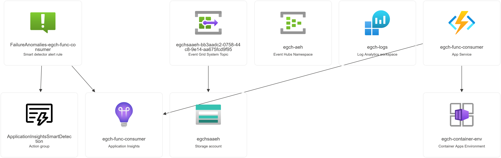
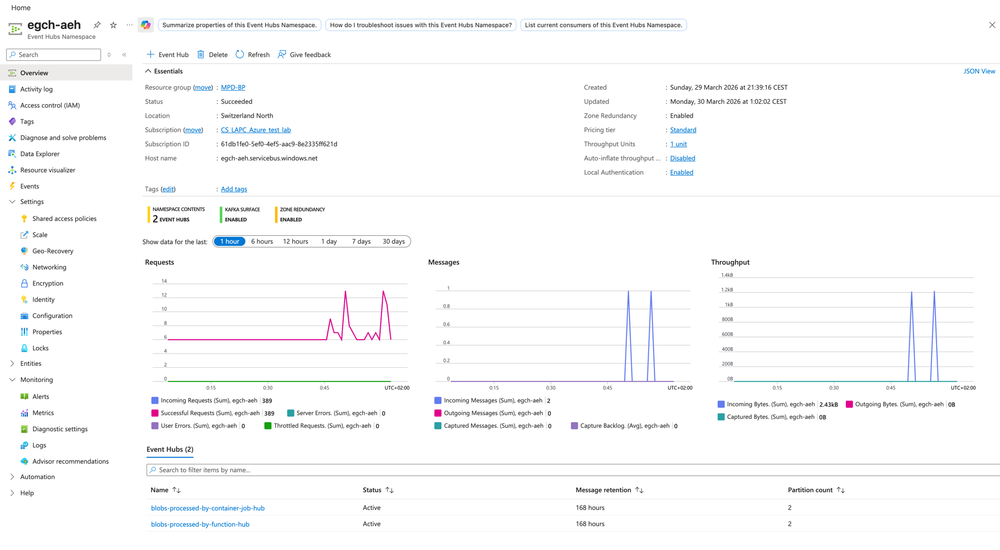
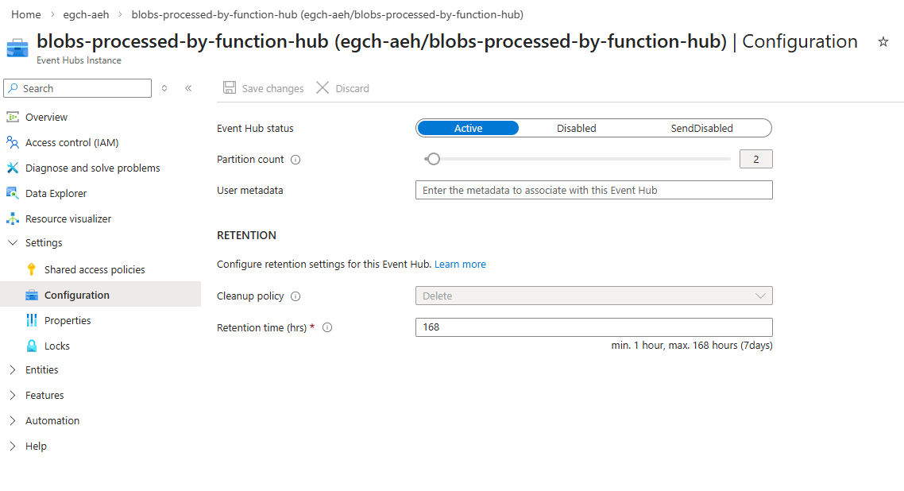
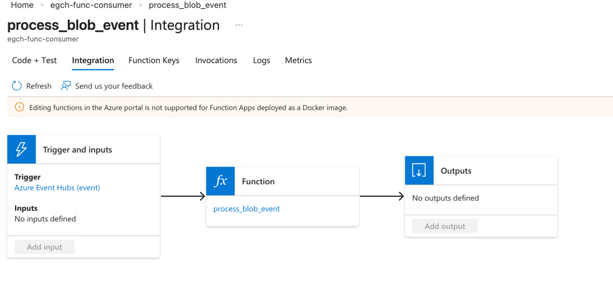
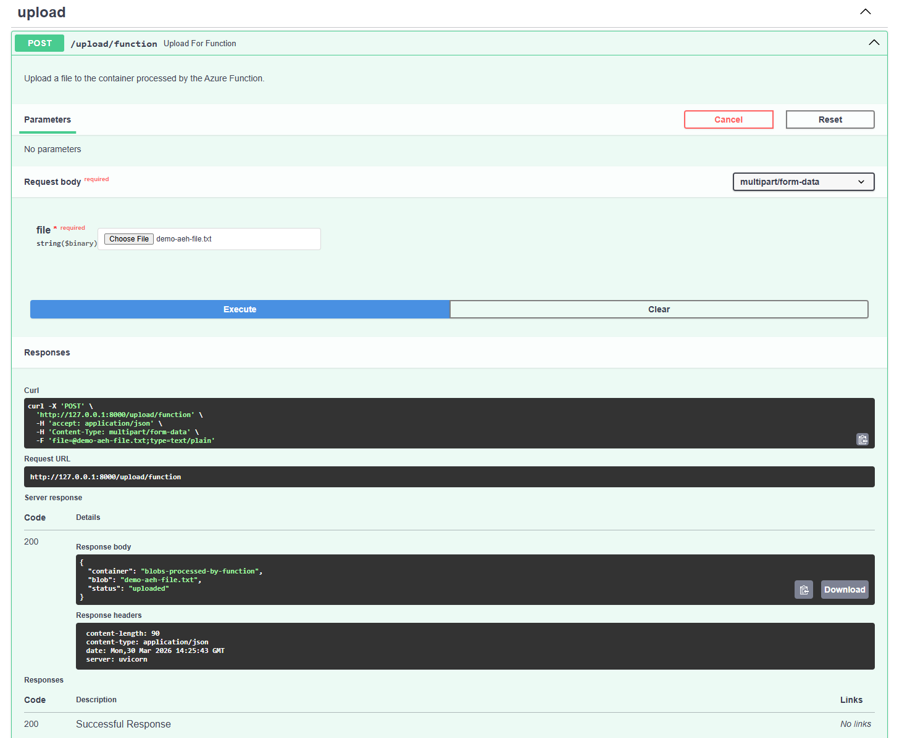
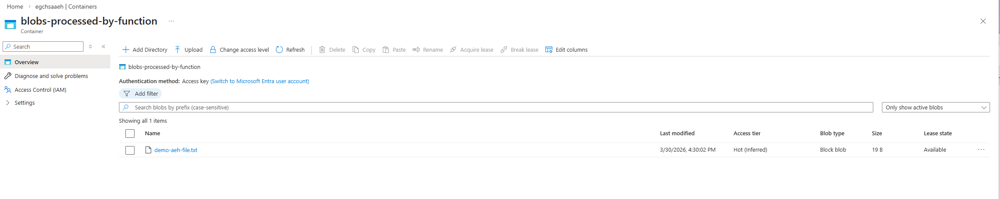
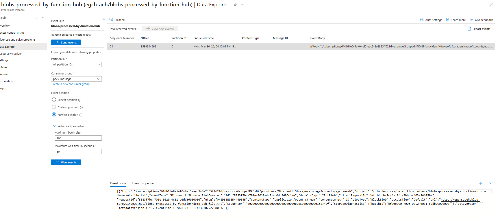
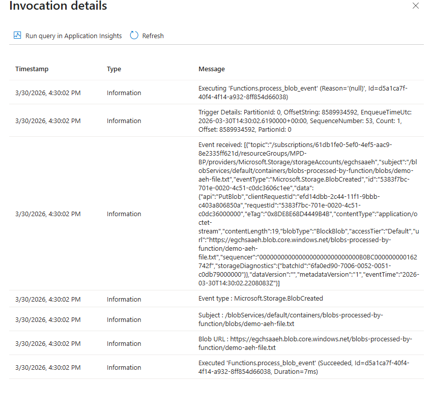
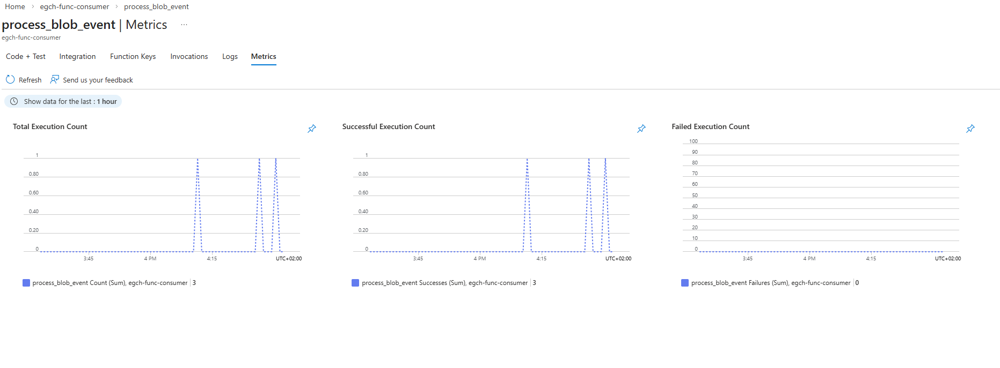

# Azure Event Hub Demo — Azure Function Consumer

## Overview

This demo shows an event-driven architecture where uploading a blob to Azure Storage
automatically triggers an Azure Function via Event Grid and Event Hub.

## Flow

```
FastAPI /upload/function
        ↓
Azure Storage (egchsaaeh)
container: blobs-processed-by-function
        ↓ BlobCreated / BlobUpdated
Event Grid Subscription (sub-blobs-processed-by-function)
        ↓
Azure Event Hub
namespace : egch-poc-aeh
hub       : blobs-processed-by-function-hub
partitions: 2
        ↓
Azure Function (egch-func-consumer)
function  : process_blob_event
trigger   : Event Hub
runtime   : Python 3.11 on Container Apps (Consumption plan)
```

### Architecture view



## Azure Resources

| Resource | Name | Type |
|---|---|---|
| Storage account | `egchsaaeh` | Standard StorageV2 |
| Storage container | `blobs-processed-by-function` | Blob container |
| Event Grid subscription | `sub-blobs-processed-by-function` | EventGrid |
| Event Hub namespace | `egch-poc-aeh` | Standard |
| Event Hub | `blobs-processed-by-function-hub` | 2 partitions |
| Container Apps Environment | `egch-container-env` | Consumption |
| Log Analytics Workspace | `egch-logs` | LAWS |
| Function App | `egch-func-consumer` | Container Apps hosted |

## Configuration

### Event Grid Subscription Filters
- **Event types:** `Microsoft.Storage.BlobCreated`, `Microsoft.Storage.BlobUpdated`
- **Subject begins with:** `/blobServices/default/containers/blobs-processed-by-function`

### Azure Function App Settings
| Setting | Value |
|---|---|
| `EVENT_HUB_CONNECTION_STRING` | Full connection string for `egch-poc-aeh` |
| `EVENT_HUB_NAME` | `blobs-processed-by-function-hub` |
| `EVENT_HUB_CONSUMER_GROUP` | `$Default` |
| `AzureWebJobsStorage` | Full connection string for `egchsaaeh` |

### Event Hub — namespace overview



### Event Hub — partition configuration

2 partitions, retention 168 hours (7 days).



### Azure Function — Event Hub Integration

The binding between the Azure Function and the Event Hub is visible in the portal under:
**`egch-func-consumer` → Functions → `process_blob_event` → Integration**

It shows the Event Hub trigger configured with the hub name and consumer group, confirming the function is wired to `blobs-processed-by-function-hub`.



### Scaling
- **Min replicas:** 0 (scales to zero when idle)
- **Max replicas:** 10 (bounded by partition count — 2 partitions = max 2 useful instances)
- Scaling is automatic based on number of unprocessed messages in the Event Hub

## Docker Image

The Azure Function is packaged as a Docker image and published to Docker Hub:

```
docker.io/egch/func-consumer:latest
```

Built from `func_consumer/Dockerfile` using the official Azure Functions Python base image:
```
mcr.microsoft.com/azure-functions/python:4-python3.11
```

## Deployment Scripts

Located in `azure-cli/`, run in order:

```shell
source .env
./azure-cli/00_login.sh                # authenticate to Azure
./azure-cli/01_create_storage.sh       # create storage account + container
./azure-cli/02_create_eventhub.sh      # create Event Hub namespace + hub
./azure-cli/03_create_eventgrid.sh     # wire Event Grid → Event Hub
./azure-cli/04_deploy_function.sh      # build image, deploy Function App, set env vars
```

## How to Trigger

Upload a file via the FastAPI Swagger UI at http://127.0.0.1:8000/docs — use `POST /upload/function` with a file attachment.



### File lands in the storage container

After a successful upload, the blob appears in the `blobs-processed-by-function` container.



### Event Hub receives the message

The BlobCreated event is routed by Event Grid to the Event Hub. You can inspect it via the Data Explorer.



## How to Monitor

### Function invocations
**Portal → `egch-func-consumer` → Functions → `process_blob_event` → Invocations**

The invocation log shows the full event payload received from the Event Hub, including event type, blob subject, and blob URL.



### Function metrics
**Portal → `egch-func-consumer` → Functions → `process_blob_event` → Metrics**



### Logs in Log Analytics Workspace
```kql
ContainerAppConsoleLogs
| where ContainerName contains "egch-func-consumer"
| order by TimeGenerated desc
| project TimeGenerated, Log
```

### Event Hub metrics
**Portal → Event Hub namespace → `blobs-processed-by-function-hub` → Metrics → Incoming Messages**

## Q&A

**Q: What happens when you upload a file to the `blobs-processed-by-function` container?**
The file lands in the container, Event Grid detects the `BlobCreated` event and routes it to the Event Hub `blobs-processed-by-function-hub`.

**Q: What triggers the Azure Function?**
The message arriving in the Event Hub — the function has an Event Hub trigger and wakes up automatically when a new message is available.

**Q: Where can you see the connection between the Event Hub and the Azure Function?**
Portal → `egch-func-consumer` → Functions → `process_blob_event` → **Integration**. It shows the Event Hub trigger configured with the hub name and consumer group.

**Q: How many instances of the Azure Function can run in parallel?**
At most **2**, one per partition. Since the hub has 2 partitions, adding more instances beyond 2 would be useless — there are no extra partitions to assign them to.

**Q: What happens when there are no messages in the Event Hub?**
The Function App **scales to zero automatically** (min replicas = 0). No manual deactivation needed — it spins back up when a new message arrives.

**Q: Where is the function code deployed?**
As a Docker image on Docker Hub (`egch/func-consumer:latest`). Azure pulls the image when the Function App starts. Note: if you push a new `latest` image, you need to restart the Function App for it to pick up the new version.

**Q: What is the role of `AzureWebJobsStorage`?**
It's the storage account used internally by the Azure Functions runtime for checkpointing (tracking which Event Hub messages have been processed), distributed locking, and internal state management. Without it the function cannot start.

**Q: How do you trigger the full chain end to end?**
Call `POST /upload/function` from the FastAPI Swagger UI — the blob lands in the container, Event Grid fires, the Event Hub receives the message, and the Azure Function triggers and processes it.

**Q: Is Azure Functions better than ACJ for Event Hub consumption?**
Yes, for most cases:
- Built-in Event Hub trigger — no KEDA or YAML needed
- Automatic scaling per partition
- Automatic checkpointing via `AzureWebJobsStorage`
- Consumption plan — pay only when executing

ACJ is better when:
- Processing takes a very long time (hours)
- Heavy batch workloads with complex dependencies
- You need fine-grained control over retry and checkpoint logic

**Q: What is the timeout limit of Azure Functions?**
Default is **10 minutes**. On Container Apps it can be increased to unlimited via `host.json`:
```json
{
  "version": "2.0",
  "functionTimeout": "02:00:00"
}
```

**Q: Can I just increase the timeout for long-running workloads?**
Technically yes, but it is not recommended. If the function crashes or the instance is recycled, all progress is lost with no way to resume. For workloads taking 1-3 hours, **ACJ is the architecturally correct choice** — it has retry logic, can checkpoint progress, and is designed for long-running batch processing.
