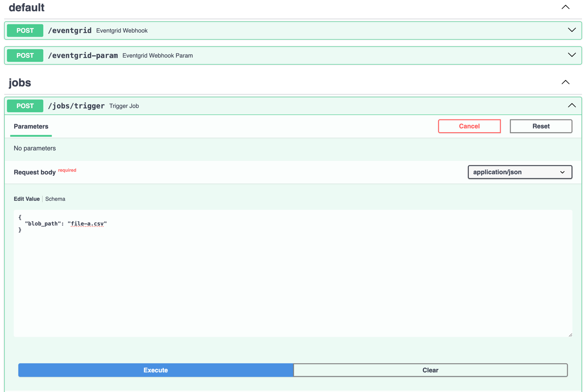
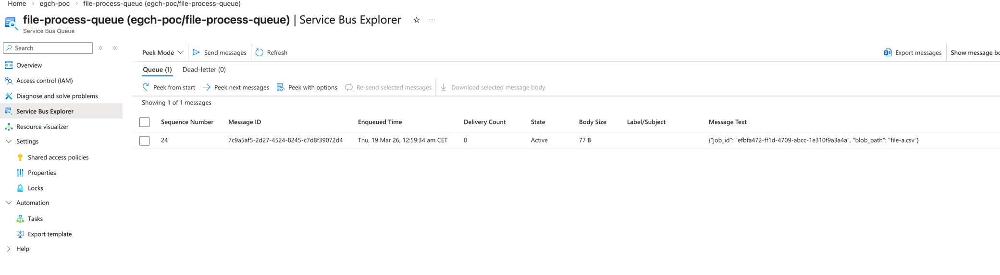
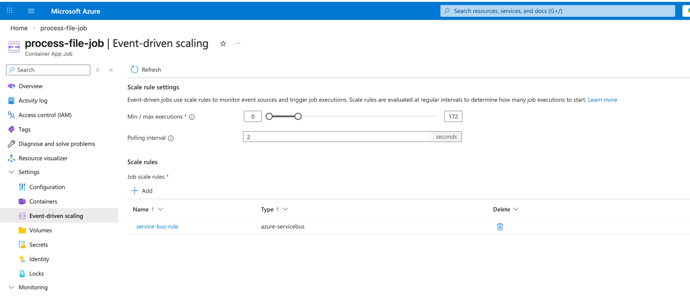
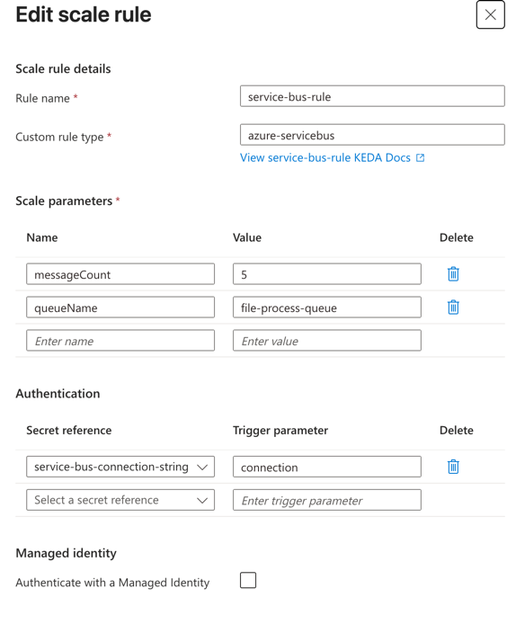
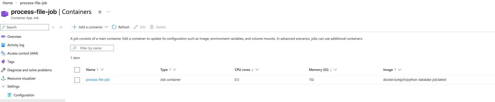
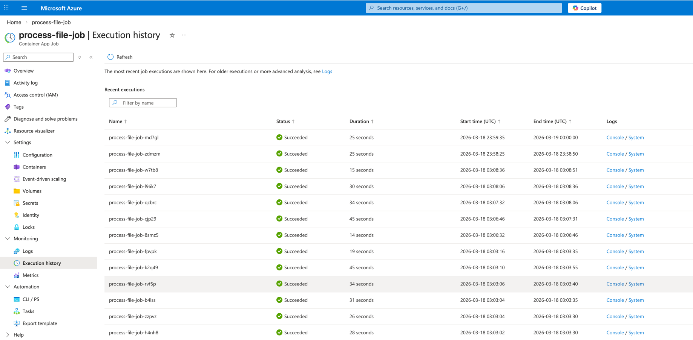
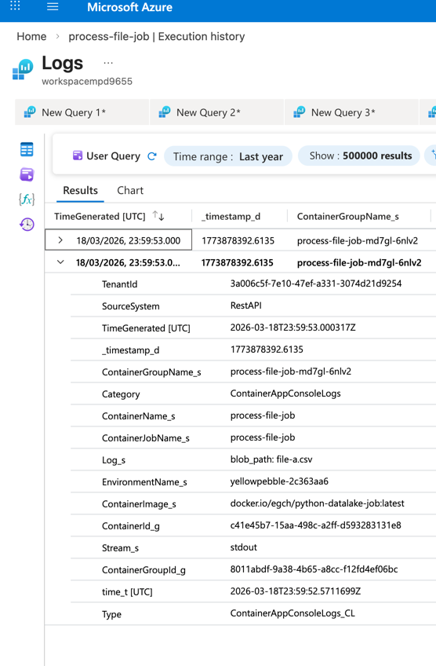
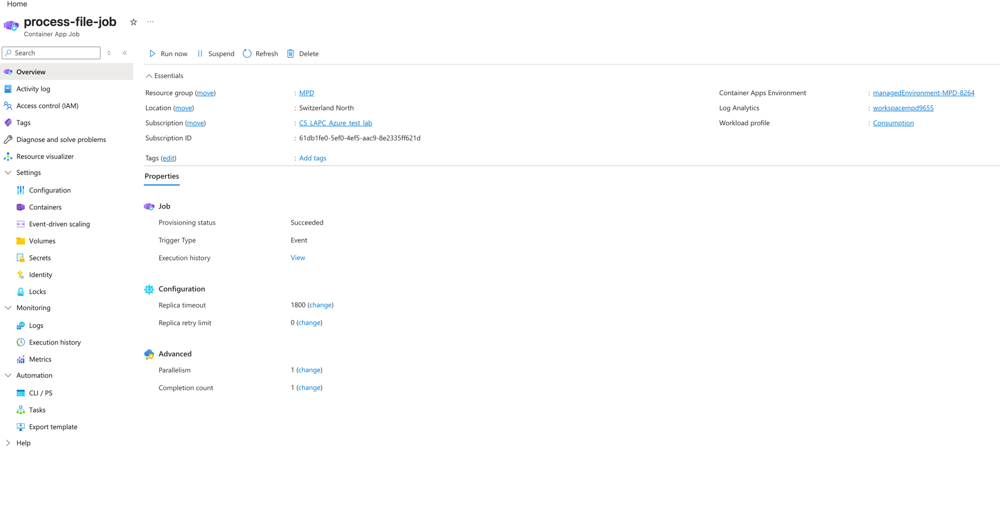

# POC: Event-Driven File Processing with Azure Container Jobs

This document describes the end-to-end flow:

**FastAPI → Service Bus Queue → Azure Container Job → Log Analytics**

---

## 1. High-Level Flow

1. A request is sent to **FastAPI**
2. FastAPI pushes a message to **Azure Service Bus Queue**
3. The queue triggers an **Azure Container Job**
4. The job processes the file (reads blob path, prints job metadata)
5. Logs are collected in **Log Analytics Workspace**

---

## 2. FastAPI – Trigger Job

FastAPI exposes an endpoint to trigger the process.

- Endpoint: `POST /jobs/trigger`
- Swagger: [http://127.0.0.1:8000/docs#/jobs/trigger_job_jobs_trigger_post](http://127.0.0.1:8000/docs#/jobs/trigger_job_jobs_trigger_post)
- Input: blob path
- Output: `job_id` + `"queued"` status

Example request:

```json
{
  "blob_path": "file-a.csv"
}
```

Example response:

```json
{
  "job_id": "b3d2f...",
  "status": "queued"
}
```



---

## 3. Service Bus Queue

FastAPI sends a message to the **Service Bus Queue**.

The message contains:
- `job_id`
- `blob_path`



---

## 4. Event-Driven Azure Container Job

The Container Job is configured with **event-driven scaling** using Service Bus (powered by KEDA under the hood).

- Trigger type: `azure-servicebus`
- Queue: `file-process-queue`





---

## 5. Scaling Parameters Explained

### messageCount = 5

This is the **target message ratio** KEDA uses to decide how many job executions to schedule:

```
desired_executions = ceil(queue_depth / messageCount)
```

| Queue depth | Executions scheduled |
|-------------|----------------------|
| 1–5         | 1                    |
| 6–10        | 2                    |
| 50          | 10                   |

So `messageCount` is not an activation threshold — it controls concurrency. With `messageCount: 5`, one execution is created for every 5 messages in the queue.

Each execution still processes **one message** (the code reads 1 message and exits). The remaining messages in each batch of 5 will be picked up in subsequent KEDA polling cycles.

### Min / Max executions = 0 / 172

- **Min = 0**: when the queue is empty, no containers are running. There is no idle cost.
- **Max = 172**: Azure will never spin up more than 172 concurrent job executions, regardless of queue depth.

### Polling interval = 2 seconds

KEDA checks the Service Bus queue every **2 seconds**. This is the maximum lag between a message arriving and a new execution being scheduled.

### One container per message?

**Yes — each message gets its own container instance, started and stopped for that message.**

The lifecycle per message:

```
Queue has message → KEDA detects (within 2s) → new container starts
→ connects to Service Bus → reads 1 message → processes it
→ completes (deletes) the message → container exits
```

There is no persistent worker sitting idle between messages. The container is cold-started per execution and shut down immediately after. This means:

- No long-running containers to manage
- No idle compute cost
- Slight cold-start overhead per message (~a few seconds)

---

## 6. Container Job Configuration

The job runs a Docker image pulled from Docker Hub:

```
docker.io/egch/python-datalake-job:latest
```



---

## 7. Job Execution

Each message triggers one job execution.

- Parallelism: 1
- Completion count: 1
- Execution duration: ~15–45 seconds



---

## 8. Processing Logic

Inside the container, the job ([source](../job/main.py)):

- Connects to the Service Bus queue
- Reads one message per run (`break` after first message)
- Parses `job_id` and `blob_path` from the JSON payload
- Prints them to stdout (captured by Log Analytics)
- Marks the message as complete

Example log output:

```
job_id: b3d2f...
blob_path: file-a.csv
```

---

## 9. Log Analytics Workspace

All container stdout/stderr is collected in **Log Analytics Workspace**.

You can query:
- Container logs
- Execution metadata
- Errors



---

## 10. Azure Container Job Overview

Main configuration:

- Trigger Type: Event
- Workload: Consumption
- Retry: 0
- Timeout: 1800s



---

## The Code

- [Job code](../job/main.py)
- [FastAPI router](../routers/jobs.py)

---

## Summary

This POC demonstrates:

- Decoupled architecture (API ≠ processing)
- Event-driven execution
- Scalable background processing
- Fully managed Azure components
- Centralized logging

---

## Next Improvements

- Use Azure Container Registry (ACR) instead of Docker Hub
- Add retry / dead-letter handling
- Add monitoring alerts
- Improve parallelism & batching
- Add idempotency for job execution

---

## Architecture Benefits

- No long-running threads in FastAPI
- Fully async processing
- Scales automatically with queue load
- Clear separation of concerns

---

## Glossary

**KEDA** (Kubernetes Event Driven Autoscaling)
Open-source autoscaler that Azure Container Apps uses internally. It watches an event source (e.g. a Service Bus queue), calculates how many job executions are needed, and tells Azure to create them. You configure it through the Azure Portal "Event-driven scaling" blade — you never interact with KEDA directly.

**messageCount**
A KEDA scale parameter that controls the ratio between queue depth and desired executions: `desired_executions = ceil(queue_depth / messageCount)`. It is not a threshold — it determines concurrency.

**Min / Max executions**
The lower and upper bounds on how many job executions Azure will run concurrently. Min = 0 means no containers run when the queue is empty (no idle cost). Max = 172 means Azure will never exceed 172 concurrent executions, regardless of queue depth.

**Polling interval**
How often KEDA checks the event source. Set to 2 seconds — this is the maximum delay between a message arriving in the queue and a new execution being scheduled.

**Cold start**
The time it takes to spin up a new container instance from scratch. Since min executions = 0, every job execution goes through a cold start (pulling the image, initializing the runtime). In this POC it adds a few seconds of latency per message.

**Dead-letter queue**
A special Service Bus sub-queue where messages end up when they cannot be processed (e.g. after max retries, or explicitly rejected). Not configured in this POC but listed as a next improvement.

**ACR** (Azure Container Registry)
Azure's private Docker image registry. Currently this POC uses Docker Hub; ACR would keep the image private and closer to the Azure infrastructure.
