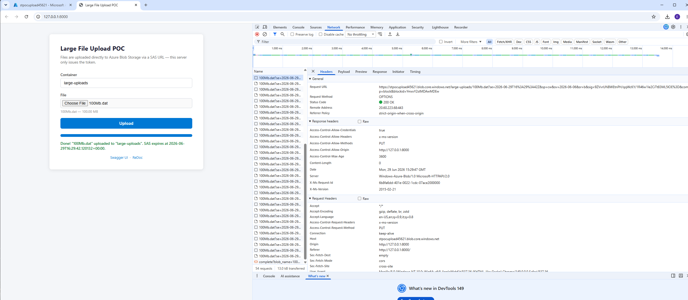
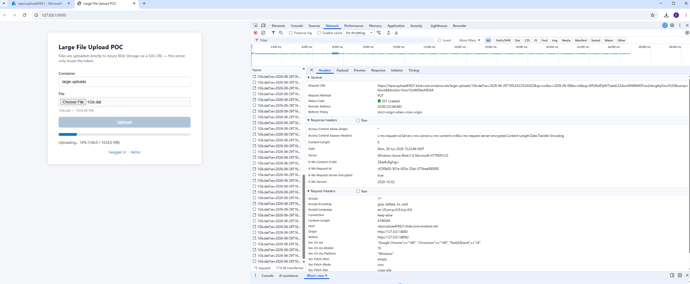
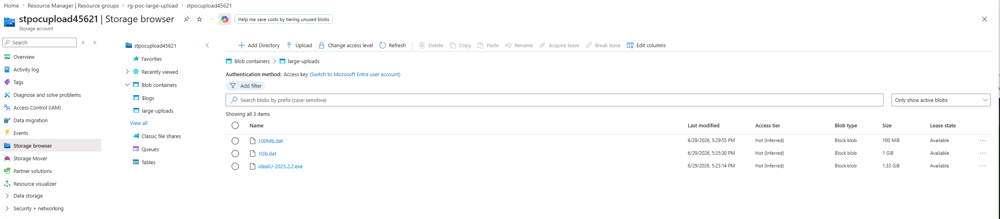

# Large File Upload POC

Demonstrates uploading files larger than 700 MB from a browser to Azure Blob Storage.

The file never passes through the FastAPI server — the backend only issues a short-lived SAS URL and the browser uploads directly to Azure using the `@azure/storage-blob` SDK, which handles chunking and parallel block upload automatically.

---

## Architecture

```
Browser  ──POST /upload/presigned-url──►  FastAPI  ──generate SAS──►  Azure Blob Storage
Browser  ──PUT (file blocks)──────────────────────────────────────►  Azure Blob Storage
Browser  ──POST /upload/complete──────►  FastAPI  (hook for downstream processing)
```

---

## Prerequisites

- [Azure CLI](https://learn.microsoft.com/en-us/cli/azure/install-azure-cli) installed and logged in (`az login`)
- Python 3.10+
- An active Azure subscription

---

## Step 1 — Provision Azure resources

The script creates a Resource Group, Storage Account, and Blob Container, configures CORS (required for direct browser uploads), and writes the `.env` file automatically.

```bash
cd poc-large-upload
bash az-cli/provision.sh
```

By default it creates:

| Resource         | Name                       |
|------------------|----------------------------|
| Resource Group   | `rg-poc-large-upload`      |
| Storage Account  | `stpocupload<timestamp>`   |
| Blob Container   | `large-uploads`            |
| Location         | `westeurope`               |

You can override any of these before running:

```bash
RESOURCE_GROUP=my-rg LOCATION=northeurope bash az-cli/provision.sh
```

If you have multiple Azure subscriptions, set the target one first:

```bash
az account set --subscription <name-or-id>
```

---

## Step 2 — Create and activate a Python virtual environment

```bash
python -m venv .venv
```

Activate it:

- **Windows (Git Bash):** `source .venv/Scripts/activate`
- **Windows (PowerShell):** `.venv\Scripts\Activate.ps1`
- **Mac / Linux:** `source .venv/bin/activate`

---

## Step 3 — Install Python dependencies

```bash
pip install -r requirements.txt
```

---

## Step 4 — Start the API

Run from the `poc-large-upload/` directory (so that `.env` is found):

```bash
uvicorn main:app --reload
```

---

## Step 5 — Upload a file

**Option A — Browser UI**

Open [http://localhost:8000](http://localhost:8000), select a file, and click Upload. A progress bar shows upload progress in real time.

100 MB file — upload completed, Network tab shows the individual block PUT requests going directly to `stpocupload45621.blob.core.windows.net`:



1 GB file — uploading at 14%, blocks of 4 MB each being PUT in parallel directly to Azure:



**Option B — Swagger**

Open [http://localhost:8000/docs](http://localhost:8000/docs) and call `POST /upload/presigned-url` manually to inspect the SAS URL response.

---

## Result in Azure

After uploading, blobs appear immediately in the `large-uploads` container in the Azure Portal Storage Browser. All files are stored as **Block blobs** in the **Hot** tier:



---

## How chunked upload works

The file is automatically split into configurable chunks (blocks) that are uploaded in parallel directly to Azure Blob Storage, making it efficient and reliable for files of any size.

- Each block is a separate `PUT` request (`?comp=block`) using the same SAS token
- Once all blocks are uploaded, a final `PUT` commit (`?comp=blocklist`) assembles them into a single blob
- Block size is set to **4 MB** by default (`static/index.html`) — Azure supports anything from 100 KB to 4000 MB per block
- If one block fails, only that block needs to be retried — not the whole file

---

## How the SAS URL works

- Valid for **1 hour** (configurable via `SAS_EXPIRY_HOURS` in `.env`)
- **Write + create only** — the caller cannot read, list, or delete blobs
- Scoped to the **exact blob name** requested — not the whole container
- Once the URL expires it is useless, even if intercepted
- A single SAS token is reused for all block requests — if the upload takes longer than the expiry, the token will need to be refreshed

---

## Triggering downstream processing

`POST /upload/complete` is called by the UI after a successful upload. Edit `routers/upload.py` to add a Service Bus or Event Hub message there to kick off a pipeline.

---

## Security considerations

### What is already safe

- Blob container is **not publicly accessible** — no anonymous reads
- SAS token is scoped to a **single blob**, **write + create only**, and **time-limited** (default 1 hour)
- The file **never passes through the FastAPI server** — no server-side exposure
- Azure encrypts data **at rest** (AES-256) and **in transit** (HTTPS)

### What must be hardened for a production / regulated environment

| Gap | Fix |
|-----|-----|
| No auth on `/upload/presigned-url` — anyone who reaches the API gets a SAS URL | Protect the endpoint with Entra ID / OAuth and only issue SAS to authenticated users |
| Account key used to sign SAS tokens — keys cannot be revoked | Switch to **User Delegation SAS** backed by a Managed Identity (UAMI) |
| CORS set to `*` | Restrict to your application's domain only |
| No malware scanning | Enable **Microsoft Defender for Storage** — it scans blobs automatically on upload |
| No identity tied to the uploaded blob | Include the authenticated user's ID in the blob path or metadata for audit trail |

### Private endpoint constraint

Banks and regulated environments typically lock storage accounts to a **private network only**, disabling public `*.blob.core.windows.net` access. Direct browser → Azure upload requires a public endpoint, so this pattern would need one of:

- **Azure Front Door + Private Link** to the storage account (browser hits Front Door publicly, traffic to storage stays private)
- **API Gateway** acting as a proxy for the upload (file routes through the server again — loses the main benefit)

---

## Cleanup

```bash
az group delete --name rg-poc-large-upload --yes --no-wait
```
